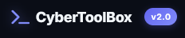
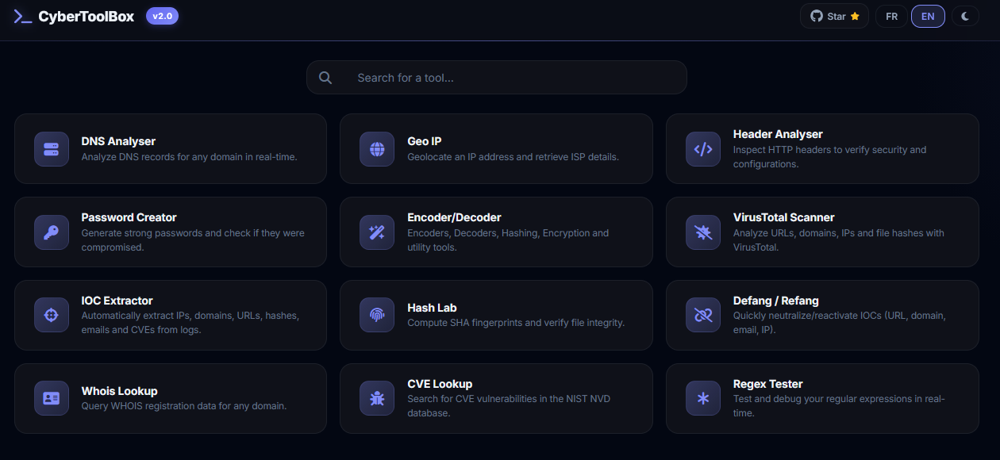

<p align="center">
  
</p>

<p align="center">
  <strong>Cybersecurity & network analysis toolkit — fully client-side.</strong>
</p>

<p align="center">
  <a href="https://choosealicense.com/licenses/mit/"></a>
  
  
  
  
</p>

---

<p align="center">
  
</p>

---

## About

CyberToolBox is a collection of security and network analysis tools that run entirely in the browser. No server, no install, no account needed — just open the page and go.

Built for SOC analysts, sysadmins, pentesters, and anyone who needs a quick and accessible cyber swiss knife.

## Available tools

| Tool | Description |
|---|---|
| **DNS Analyser** | DNS record analysis (A, AAAA, MX, TXT, CNAME, NS, SOA) with SPF/DKIM/DMARC validation and IP geolocation. Multi-provider: Google DNS / Cloudflare. |
| **Geo IP** | IP address geolocation with interactive map (Leaflet). Country, city, ISP, ASN, timezone. Auto-detects your public IP. |
| **Header Analyser** | Email header inspection: SPF/DKIM/DMARC checks, hop visualization, phishing risk scoring. |
| **Password Creator** | Password generator (1-256 chars) with entropy audit, crack time estimation and breach check via Have I Been Pwned (k-Anonymity). |
| **Encoder / Decoder** | Base64, URL, JWT, CIDR, User-Agent, Timestamp, JSON formatter, SHA hashing, AES-GCM encryption, Markdown editor. |
| **VirusTotal Scanner** | File, URL, domain and IP analysis via VirusTotal API v3. Risk score, AV detections, local history. |
| **IOC Extractor** | Automatic extraction of indicators of compromise (IPs, domains, hashes, CVEs, emails) from logs or raw text. |
| **Hash Lab** | SHA-256/512 and MD5 fingerprinting with file integrity verification. |
| **Defang / Refang** | IOC neutralization and reactivation for safe sharing (URLs, IPs, domains). |
| **Whois Lookup** | Domain WHOIS lookup via the RDAP protocol. |
| **CVE Lookup** | Vulnerability search against the NIST NVD database with CVSS scores and pagination. |
| **Regex Tester** | Real-time regex testing and debugging with common presets. |

## Getting started

This is a static site — no server-side dependencies.

```bash
git clone https://github.com/Alx0-x0/cybertoolbox.git
cd cybertoolbox
```

Open `index.html` in a browser or spin up a local server:

```bash
# Python
python -m http.server 8080

# Node
npx serve .

# VS Code
# -> "Live Server" extension -> Go Live
```

## Tech stack

- HTML5 / CSS3 (Custom Properties, Grid, Flexbox)
- Vanilla JavaScript ES6+ — no framework
- Dark / light theme with instant toggle
- Bilingual interface (FR / EN)
- Responsive design (mobile, tablet, desktop)

**External libraries (CDN):**
- [Font Awesome](https://fontawesome.com/) — icons
- [Leaflet](https://leafletjs.com/) — maps (Geo IP)
- [Marked](https://marked.js.org/) — Markdown rendering
- [CryptoJS](https://github.com/brix/crypto-js) — crypto fallback for HTTP

## APIs used

| Service | Purpose |
|---|---|
| Google DNS over HTTPS | DNS resolution |
| Cloudflare DoH | DNS resolution (alternate) |
| ipwho.is / ipapi.co / geojs.io | IP geolocation |
| Have I Been Pwned | Breach checking (k-Anonymity) |
| VirusTotal API v3 | Threat analysis |
| NIST NVD API v2.0 | CVE database |
| RDAP | Whois lookups |

## Project structure

```
cybertoolbox/
├── assets/images/           # Logo, screenshots
├── src/
│   ├── assets/styles/       # Modular CSS (variables, layout, components...)
│   └── js/
│       ├── components/      # Navigation, transitions
│       └── utils/           # Helpers, i18n, VirusTotal API
├── tools/
│   ├── _shared/             # Shared shell (header, theme, transitions)
│   ├── dns-analyser/
│   ├── geo-ip/
│   ├── header-analyser/
│   ├── password-creator/
│   ├── encoder-decoder/
│   ├── virustotal/
│   ├── ioc-extractor/
│   ├── hash-lab/
│   ├── defang-refang/
│   ├── whois-lookup/
│   ├── cve-lookup/
│   └── regex-tester/
├── index.html               # Home page
├── config.json              # Project configuration
└── LICENSE
```

## Security

- Runs 100% client-side — no data hits a third-party server (aside from public APIs)
- VirusTotal API key stored in `localStorage` only
- Password checks use k-Anonymity (only the hash prefix is sent)
- HTTPS recommended for production

## Author

Built by **[Alx0](https://github.com/Alx0-x0)**

## License

Distributed under the [MIT](LICENSE) license.

---

*If you find this useful, drop a star on the repo.*
